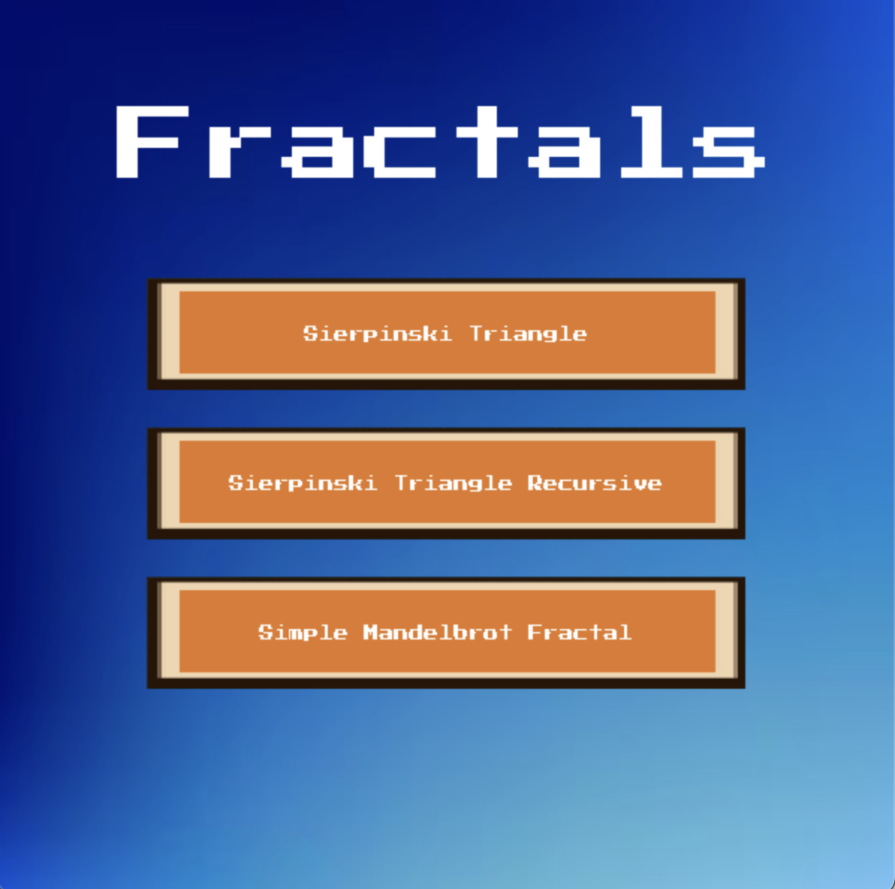
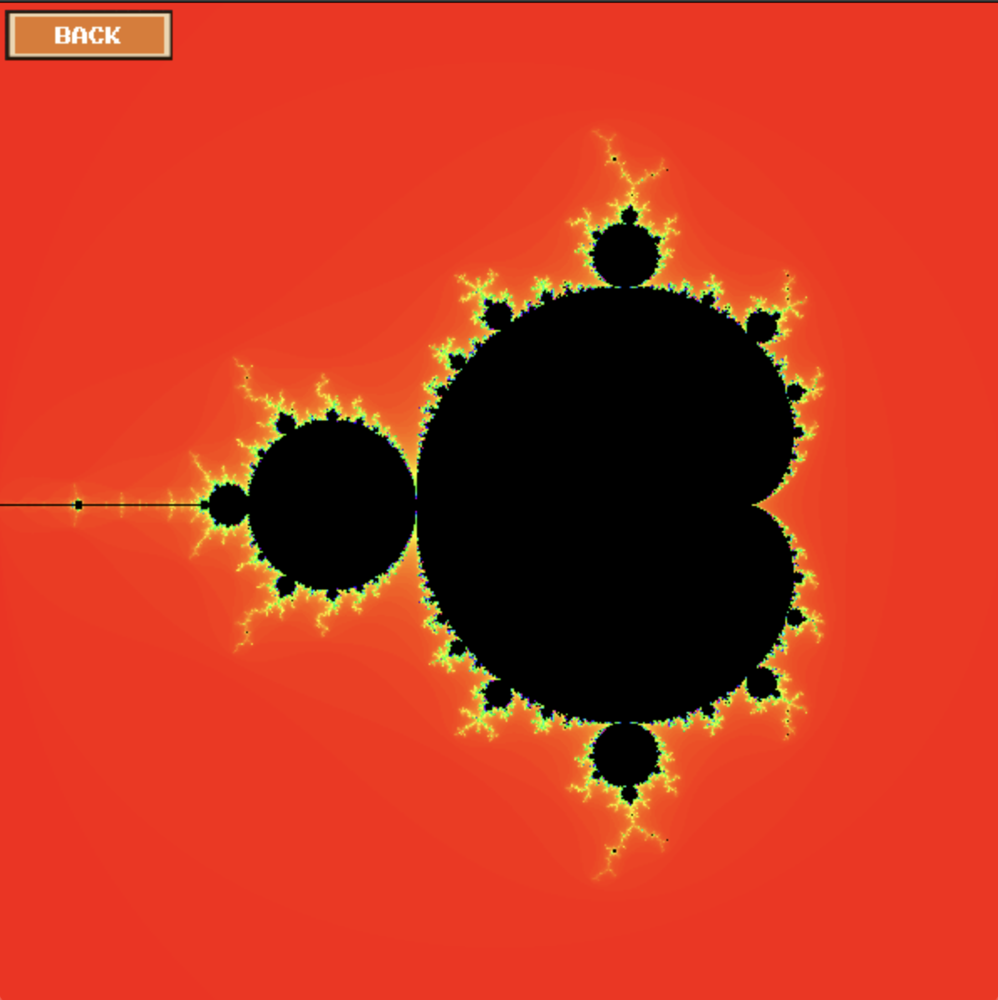
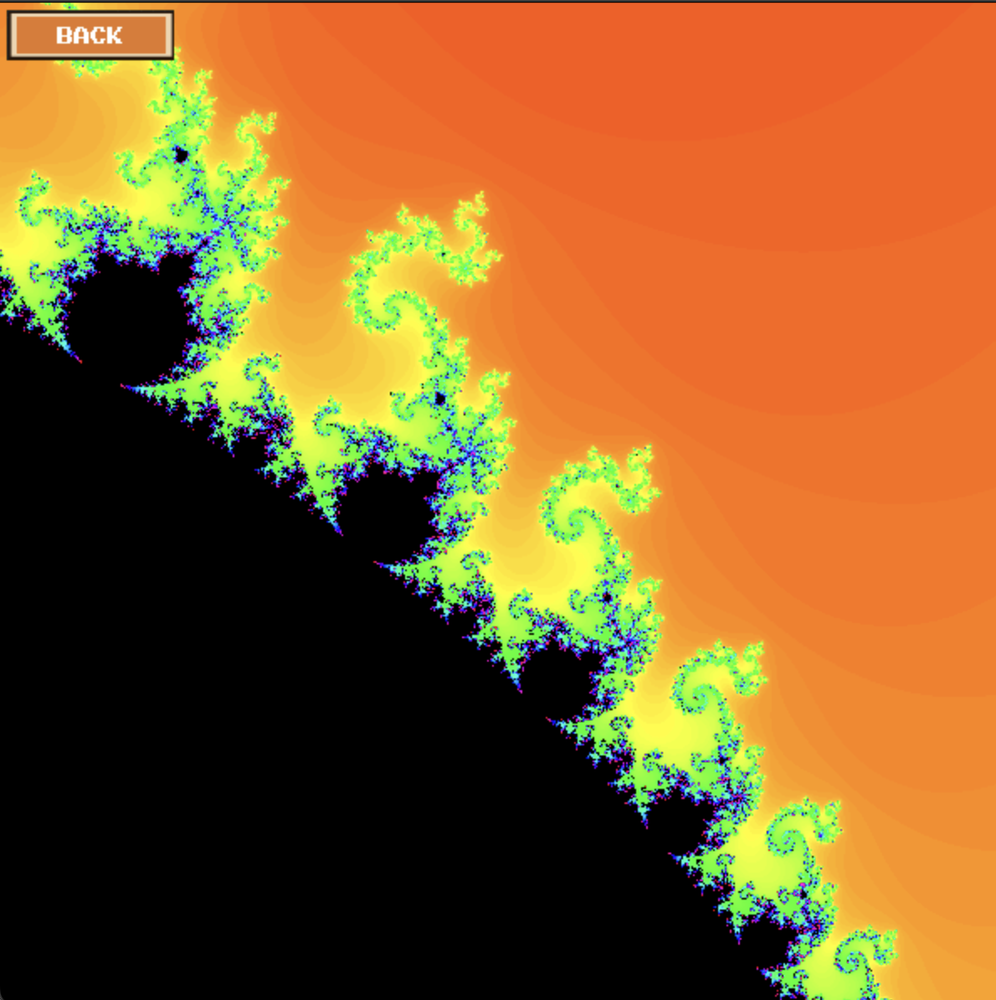
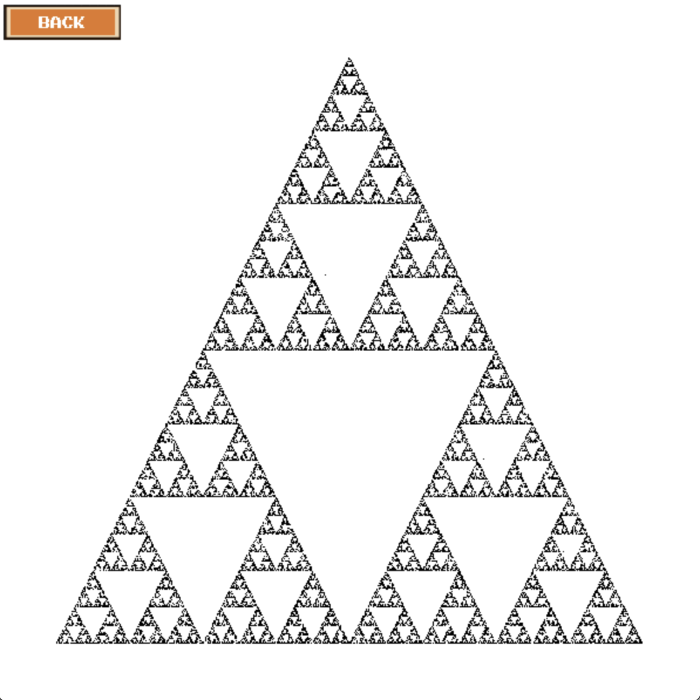
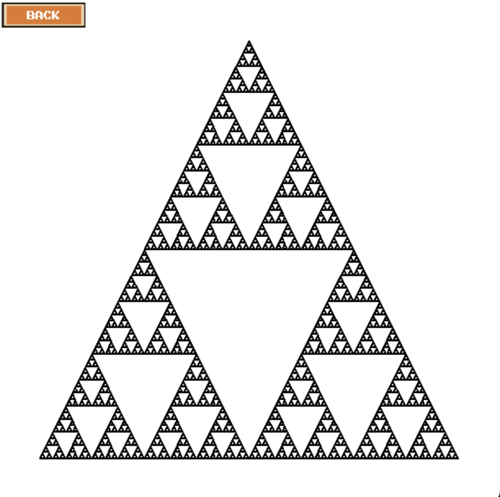
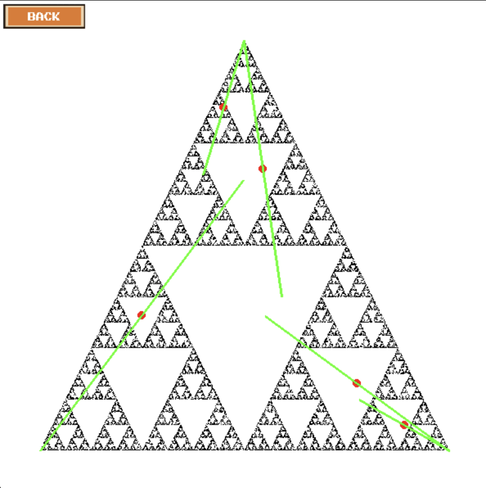

# Simple Fractal Visualizer

A Python (Pygame) fractal visualizer that renders classic fractals using complex-number math and interactive drawing. Includes:
- **Mandelbrot Set** (click to zoom)
- **Sierpinski Triangle** via **Chaos Game** (pick a starting point + draw helper lines)
- **Sierpinski Triangle** via **Recursion**

## Demo 
- Open a **main menu** and choose a fractal to explore.
- **Mandelbrot**: render the set, then **zoom in by clicking** different points.
- **Sierpinski (Chaos Method)**: click once to start the chaos game, then optionally click to draw lines/points.
- **Sierpinski (Recursive)**: render the triangle recursively.

## Tech Stack
- **Python**
- **Pygame** (rendering + UI)
- **Complex numbers / iterative math** (Mandelbrot computations)

## Known Issues and limitations

- **Zooming is slow.**  
  Each zoom triggers a *full recomputation* of the Mandelbrot set for every pixel (`WIDTH × HEIGHT`), with up to `MAX_ITERATIONS` iterations per pixel. This makes zooming really slow. The rendering complexity is around `O(WIDTH × HEIGHT × MAX_ITERATIONS)` per frame (per zoom).

- **Zoom depth is limited (not infinite zoom).**  
  This implementation uses floating-point math and a fixed screen resolution. After enough zooms, you run into practical limits:
  - **Precision**: small viewports lose detail due to floating-point rounding.
  - **Resolution**: once features are smaller than a pixel, additional zoom doesn’t reveal new structure.
  - **Rendering cost**: re-render time increases and becomes impractical.

### Potential fixes 
- Use **incremental rendering** (render rows/tiles over time instead of freezing).
- Add **NumPy acceleration** or multiprocessing for pixel computation.
- Improve zoom UX (zoom box, zoom out, cached renders).
- Use higher-precision arithmetic for deep zoom exploration.

## Screenshots

### Main Menu


### Mandelbrot Set



### Sierpinski Triangle (Chaos Game)



### Sierpinski Triangle (Recursive)


## Getting Started

### Requirements
- Python 3.x
- Pygame

Install dependencies:
```bash
pip install pygame
